# V22 Fit Connect — Fases de desenvolvimento da v1

Ordem de construção da v1. Cada fase termina com um marco testável. Telas pelos códigos de [`telas.md`](telas.md); tabelas em [`modelo-dados.md`](modelo-dados.md).

## Como trabalhamos

- **Ordem**: primeiro o aluno usando sozinho (inclui offline e cronômetros), depois o professor por cima.
- **Git**: commits direto na `main`. GitHub Actions roda lint, checagem de tipos e testes a cada push.
- **Testes**: cobertura ampla. Unidade e componentes (Jest + Testing Library), regras de acesso do banco (testes SQL de RLS), ponta a ponta (Maestro) nos fluxos de cada fase. Uma fase só fecha com os testes dela passando.
- **Supabase**: um único projeto na nuvem, usado desde o desenvolvimento e que vira a produção definitiva, testado em 2 ou mais celulares reais. Migrations sempre versionadas no repositório. Os testes automatizados de banco (RLS) rodam no GitHub Actions, num banco temporário, sem tocar na nuvem. Antes do beta, os dados de teste da nuvem são limpos.
- **Beta**: só com tudo pronto (fase 13). Antes disso, os testes são seus, no seu celular.
- **Pronto quando**: telas da fase feitas em PT/EN/ES, tema claro e escuro, tablet, fonte do sistema e testes passando.

## Estrutura do repositório

```
apps/mobile      App Expo (React Native)
apps/web         Site React + Vite (área do professor + admin)
packages/core    Regras compartilhadas: tipos, cálculos (volume, recordes, sequência), validações, conversão kg/lb
packages/i18n    Textos PT/EN/ES
packages/ui      Tokens de design (cores, espaçamentos, tipografia)
supabase/        Migrations, políticas RLS, funções, seeds e testes do banco
landing/         Landing page estática
```

## Fases

```mermaid
flowchart LR
    F0[0 Fundação] --> F1[1 Conta] --> F2[2 Exercícios] --> F3[3 Séries do aluno] --> F4[4 Treino] --> F5[5 Progresso]
    F5 --> F6[6 Professor] --> F7[7 Avaliações] --> F8[8 Motivação] --> F9[9 Diretório]
    F9 --> F10[10 Web do professor] --> F11[11 Admin] --> F12[12 Suporte e LGPD] --> F13[13 Lançamento]
```



### Fase 0 — Fundação

- Monorepo, Expo, Vite, TypeScript, lint, GitHub Actions.
- Projeto Supabase existente na nuvem, migrations versionadas.
- Tema claro/escuro com os tokens da marca, fontes, componentes base (botão, campo, cartão, lista, estado vazio com mascote).
- i18n PT/EN/ES com detecção do idioma do aparelho.
- Sentry e PostHog.
- Motor de sincronização SQLite ↔ Supabase (fila de envio, `sync_seq`, exclusão lógica, conflitos), com testes pesados, antes de qualquer tela depender dele.
- **Marco**: app abre no celular com splash e ícone da marca, troca de tema e idioma; sincronização testada isoladamente.

### Fase 1 — Conta e entrada

- Telas E-01 a E-13; perfil (AL-50, AL-51); configurações (C-30, C-31, C-33).
- Login e-mail/senha, Google e Apple; verificação de e-mail; biometria.
- Escolha de papel (só "aluno" funcional até a fase 6), dados básicos, validação 16+.
- Versão mínima do app (C-41) e sem conexão (C-40).
- **Marco**: criar conta, entrar, sair, reabrir com biometria, em qualquer idioma e tema.

### Fase 2 — Base de exercícios

- Importação do Free Exercise DB; imagens no Storage.
- Tradução PT/ES em lote por IA + textos de descrição/execução como rascunho.
- Admin mínimo: login com 2FA (AD-01), exercícios oficiais (AD-10, AD-11), filas de textos e traduções (AD-13, AD-14).
- App: guia do exercício (C-01), busca offline com autocomplete tolerante a erros (C-02), criar exercício (C-03, AL-53).
- Cache de imagens (séries + sob demanda).
- **Marco**: buscar "supino" sem internet, com erro de digitação, e abrir o guia com animação.

### Fase 3 — Séries do aluno

- Editor de série (C-10 a C-13): sequência com nomes livres ou por dia da semana, blocos, todos os tipos de prescrição, aquecimento, drop-set, rest-pause, cadência, descanso, tipo de carga.
- AL-10 a AL-13, AL-02; versões de série (`plan_versions`).
- kg/lb.
- **Marco**: montar sua própria série completa offline e vê-la no outro aparelho depois de sincronizar.

### Fase 4 — Treino em execução

- TR-01 a TR-07, TR-11; Início com treino de hoje (AL-01).
- Cronômetros de exercício e descanso, ±15 s, pular; alarme com som e vibração; notificação fixa em segundo plano e tela bloqueada.
- Substituir exercício, observações, auto-finalizar após 3 h.
- **Marco**: treinar de verdade na academia, em modo avião, com o celular bloqueado entre as séries.

### Fase 5 — Progresso

- Histórico e treino realizado (AL-20 a AL-23), treino manual e edição.
- Gráficos de evolução e recordes (AL-24, AL-25), sem aquecimento e sem misturar tipos de carga.
- Peso (AL-31).
- **Marco**: depois de algumas semanas de uso, histórico, gráficos e recordes batem com o que foi feito.

### Fase 6 — Professor e vínculo

- Papel professor (E-09, AL-54), modo aluno, abas do professor.
- Convites por código e link (AL-45, AL-46, LP-06), desvínculo e todas as regras (séries somem, histórico fica, ex-alunos só leitura).
- Alunos, ficha, treinos, evolução (PR-10, PR-11, PR-14, PR-15, PR-17).
- Séries para aluno, modelos, aplicar e copiar (PR-16, PR-20 a PR-22); aviso de série atualizada.
- Painel de adesão (PR-01); série vencida e aviso de 3 dias.
- Push (Expo Push), sininho (C-20), preferências e lembrete de treino.
- Limite de alunos por professor.
- **Marco**: você como professor monta uma série para outra conta sua, ela treina, você recebe o aviso e vê o resumo.

### Fase 7 — Anamnese e avaliações

- Anamnese (AL-52, PR-12), avaliações e fotos (AL-26 a AL-28, PR-13).
- Consentimento dos dados de saúde por professor (AL-41), aviso de anamnese vazia.
- **Marco**: professor só vê anamnese e fotos depois que o aluno autoriza; ao revogar, perde o acesso na hora.

### Fase 8 — Motivação

- Meta semanal e sequência, conquistas (AL-29, TR-10), celebração de recorde (TR-08).
- Resumo semanal/mensal compartilhável (AL-30), foto do treino com arte (TR-09).
- Poses do mascote geradas para cada tela.
- **Marco**: bater um recorde mostra a harpia; a foto sai com logo e resumo e vai para o Instagram.

### Fase 9 — Diretório

- Perfil público, local e currículo (PR-31 a PR-35); busca por cidade, filtros e "perto de mim" (AL-42, AL-43).
- Pedidos de vínculo (AL-44, PR-02) com limite e expiração.
- Denunciar, bloquear, filtro de palavras (C-32, C-38).
- **Marco**: aluno sem professor encontra um perto dele, pede vínculo e começa a treinar com a série dele.

### Fase 10 — Web do professor

- W-01 a W-40, responsivo; editor de série com arrastar e soltar e atalhos de teclado.
- **Marco**: montar a série no computador e o aluno recebê-la no celular.

### Fase 11 — Admin completo

- Painel com métricas e cotas (AD-02), fila de exercícios de usuários (AD-12), usuários e sanções, selo CREF (AD-20), diretório (AD-21), denúncias (AD-22).
- Push em massa (AD-30), FAQ e textos (AD-31), conquistas (AD-32), configurações (AD-40), equipe e papéis (AD-41), log de ações (AD-42).
- **Marco**: todas as filas e ações funcionam e aparecem no log.

### Fase 12 — Suporte e LGPD

- FAQ (C-36), fale conosco com print (C-37, AD-23), sobre (C-39).
- Exportar dados (C-34), exclusão com 30 dias e anonimização (C-35, E-12), conta de professor excluída → séries viram do aluno.
- Backup semanal via GitHub Actions.
- Termos e política de privacidade (revisão por advogado).
- **Marco**: excluir uma conta de teste e verificar, depois de 30 dias simulados, que nada pessoal restou.

### Fase 13 — Lançamento

- Revisão de desempenho, acessibilidade (fonte e treino sem olhar) e tablet em todas as telas.
- Landing page (LP-01 a LP-05), domínio, e-mail de suporte.
- Conta Google Play, fichas das lojas, capturas de tela.
- Beta fechado: 5–10 professores e seus alunos (cobre a exigência de 12 testadores por 14 dias).
- Limpeza dos dados de teste da nuvem antes do beta.
- Correções do beta e publicação na Play Store; App Store quando a taxa da Apple for paga.

## Antes de começar a fase 0

- [x] Projeto Supabase na nuvem (já existe)
- [ ] Conta Expo (EAS) gratuita
- [ ] Contas Sentry e PostHog gratuitas
- [ ] Credenciais de login Google (Google Cloud) e Apple (exige conta Apple Developer, que pode esperar até a fase 13; até lá, testar Apple só no simulador ou deixar para depois)
