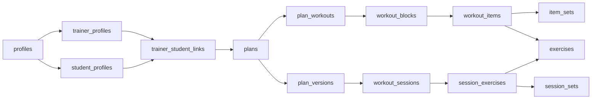

# V22 Fit Connect — Modelo de dados

Banco Postgres no Supabase, espelhado em parte no SQLite do aparelho. Regras de negócio em [`planejamento-app.md`](planejamento-app.md); telas em [`telas.md`](telas.md).

## Convenções

- **Ids**: `uuid` v7 gerado no próprio aparelho, para criar registros offline sem conflito.
- **Colunas de controle** em toda tabela sincronizada: `created_at`, `updated_at`, `deleted_at` (exclusão lógica, para a exclusão chegar aos outros aparelhos) e `sync_seq` (número crescente do servidor, usado para baixar só o que mudou).
- **Carga sempre em kg** no banco; conversão para lb só na exibição.
- **Textos fixos do app** (músculos, equipamentos, objetivos) são códigos; a tradução fica nos arquivos de idioma do app, não no banco.
- **Segurança**: RLS (Row Level Security) em todas as tabelas; o aparelho só lê e grava o que a regra permite. Operações sensíveis (aceitar convite, desvincular, excluir conta) rodam em funções no servidor.
- **Dados de saúde** (anamnese, avaliações, fotos) só são lidos pelo próprio aluno e por professores com `share_health = true` no vínculo ativo.

## Visão geral

Séries são editadas nas tabelas `plans → item_sets`; a cada publicação gera-se um retrato imutável em `plan_versions`. O treino executado aponta para a versão usada, então mudanças do professor nunca alteram o histórico.

## Contas e perfis

| Tabela | Campos principais | Observações |
| --- | --- | --- |
| `profiles` | `id` (= auth.users), `name`, `avatar_path`, `birth_date`, `sex`, `country`, `language`, `weight_unit`, `theme`, `status` (active, suspended, pending_deletion), `deletion_requested_at`, `username` | `username` fica vazio na v1; reservado para a rede social |
| `user_roles` | `user_id`, `role` (student, trainer, admin, reviewer) | Um usuário pode ter vários papéis |
| `student_profiles` | `user_id`, `height_cm`, `goal`, `weekly_goal` | Peso fica em `weight_logs` |
| `weight_logs` | `student_id`, `weight_kg`, `logged_on`, `assessment_id` | O peso do cadastro é o primeiro registro; avaliação com peso também gera um |
| `anamneses` | `student_id`, `injuries`, `conditions`, `medications`, `medical_clearance`, `clearance_date` | 1 por aluno; dado sensível |
| `trainer_profiles` | `user_id`, `cref`, `cref_verified_at`, `bio`, `specialties[]`, `modality`, `price_min`, `price_max`, `currency`, `instagram`, `whatsapp`, `gym_name`, `city`, `state`, `neighborhood`, `location` (ponto PostGIS), `directory_opt_in`, `public_fields[]`, `hidden_by_admin`, `student_limit` | `location` nunca sai do servidor; a busca devolve só a distância arredondada |
| `trainer_resume_items` | `trainer_id`, `kind` (education, postgrad, certification, experience), `title`, `institution`, `year_start`, `year_end`, `position` | Currículo estruturado |

## Vínculos, convites e moderação

| Tabela | Campos principais | Observações |
| --- | --- | --- |
| `trainer_student_links` | `trainer_id`, `student_id`, `status` (active, ended), `started_at`, `ended_at`, `ended_by`, `share_health` | Base de quase todas as regras de acesso |
| `invites` | `code`, `created_by`, `creator_role`, `expires_at`, `used_by`, `used_at` | Uso único, 7 dias |
| `link_requests` | `student_id`, `trainer_id`, `message`, `status` (pending, accepted, declined, expired), `expires_at` | Máx. 3 pendentes por aluno (checado no servidor) |
| `user_blocks` | `blocker_id`, `blocked_id` | Impede convites e pedidos |
| `reports` | `reporter_id`, `target_user_id`, `reason`, `details`, `status`, `resolved_by`, `resolution` | Fila de denúncias |
| `user_sanctions` | `user_id`, `kind` (suspension, ban), `reason`, `created_by`, `until` | Histórico de punições |

## Exercícios

| Tabela | Campos principais | Observações |
| --- | --- | --- |
| `exercises` | `origin` (official, user), `owner_id`, `status` (draft, published), `review_status` (pending, promoted, merged, dismissed), `merged_into_id`, `primary_muscle`, `secondary_muscles[]`, `body_part`, `equipment`, `level`, `default_load_type`, `image_start_path`, `image_end_path`, `source_ref` | `source_ref` = id no Free Exercise DB |
| `exercise_translations` | `exercise_id`, `lang`, `name`, `description`, `execution`, `reviewed_at`, `reviewed_by` | Descrição/execução só aparecem se revisadas |
| `exercise_aliases` | `exercise_id`, `lang`, `alias`, `origin` (ai, user), `approved` | Alimenta o autocomplete |
| `exercise_shares` | `exercise_id`, `trainer_id`, `can_edit` | Aluno libera seu exercício para um professor |
| `exercise_usage` | `user_id`, `exercise_id`, `count`, `last_used_at` | Ordena o autocomplete; só no aparelho + backup |

Exercício de professor fica visível ao aluno que tem série com ele (regra RLS via `workout_items`).

## Séries

| Tabela | Campos principais | Observações |
| --- | --- | --- |
| `plans` | `author_id`, `student_id` (vazio = modelo), `trainer_id`, `is_template`, `name`, `organization` (sequence, weekday), `start_date`, `end_date`, `weekly_goal`, `copied_from_id`, `current_version`, `status` (active, archived), `orphaned` | `orphaned` = professor excluiu a conta; série passa ao aluno |
| `plan_workouts` | `plan_id`, `name`, `position`, `weekday` | Nome livre na sequência; `weekday` na organização por dia |
| `workout_blocks` | `workout_id`, `position`, `kind` (single, biset, triset) | |
| `workout_items` | `block_id`, `exercise_id`, `position`, `rest_seconds`, `cadence`, `load_type`, `notes` | |
| `item_sets` | `item_id`, `position`, `is_warmup`, `set_type` (normal, dropset, restpause), `target` (reps, range, failure, time, cardio), `reps_min`, `reps_max`, `duration_s`, `distance_m`, `intensity`, `load_kg`, `mini_sets` (json) | `mini_sets` = quedas do drop-set / pausas do rest-pause |
| `plan_versions` | `plan_id`, `version`, `snapshot` (json da série inteira), `published_at` | Imutável |

## Execução

| Tabela | Campos principais | Observações |
| --- | --- | --- |
| `workout_sessions` | `student_id`, `plan_id`, `plan_version`, `workout_id`, `started_at`, `ended_at`, `auto_finished`, `manual`, `notes`, `volume_kg` | `volume_kg` calculado ao finalizar (sem aquecimento) |
| `session_exercises` | `session_id`, `position`, `exercise_id`, `planned_item_id`, `substituted_from_id`, `load_type` | Substituição guarda o exercício original |
| `session_sets` | `session_exercise_id`, `position`, `parent_set_id`, `is_warmup`, `set_type`, `status` (done, skipped), `load_kg`, `reps`, `duration_s`, `distance_m`, `exercise_time_s`, `rest_s`, `notes` | `parent_set_id` liga a mini-série à série |
| `personal_records` | `student_id`, `exercise_id`, `load_type`, `reps`, `load_kg`, `session_set_id`, `achieved_at` | Cache recalculável a partir de `session_sets` |

## Avaliações

| Tabela | Campos principais | Observações |
| --- | --- | --- |
| `assessments` | `student_id`, `author_id`, `assessed_on`, `weight_kg`, `body_fat_pct`, `measurements` (json: cintura, quadril, braço…), `notes` | Autor pode ser aluno ou professor |
| `assessment_photos` | `assessment_id`, `storage_path`, `pose` (front, side, back) | Bucket privado; acesso por URL assinada |

## Motivação e notificações

| Tabela | Campos principais | Observações |
| --- | --- | --- |
| `achievements` | `code`, `rule` (json), `mascot_pose`, `position` | Catálogo, editável no admin |
| `user_achievements` | `user_id`, `code`, `achieved_at` | Sequência semanal é calculada, não gravada |
| `push_tokens` | `user_id`, `token`, `platform`, `device_name`, `last_seen_at` | |
| `notifications` | `user_id`, `type`, `data` (json), `read_at` | Alimenta o sininho |
| `notification_prefs` | `user_id`, `type`, `enabled` | |
| `training_reminders` | `user_id`, `weekdays[]`, `time`, `timezone` | Agendado no próprio aparelho |

## Suporte, conteúdo e admin

| Tabela | Campos principais | Observações |
| --- | --- | --- |
| `support_tickets` | `user_id`, `kind` (contact, bug), `subject`, `message`, `screenshot_path`, `app_version`, `device`, `status` | |
| `faq_entries` | `lang`, `question`, `answer`, `position`, `status` (draft, published) | Revisor edita, admin publica |
| `broadcasts` | `audience` (json), `texts` (json por idioma), `scheduled_at`, `sent_at`, `created_by` | Push em massa |
| `app_config` | `key`, `value` | Versão mínima, limite padrão de alunos, palavras bloqueadas |
| `admin_audit_log` | `actor_id`, `action`, `target_table`, `target_id`, `details`, `created_at` | Somente inserção |
| `data_exports` | `user_id`, `status`, `storage_path`, `expires_at` | Arquivo de "exportar meus dados" |

## Sincronização offline

- **No aparelho (SQLite)**: perfil próprio, vínculos, séries atribuídas e próprias (com as versões), treinos, recordes, avaliações (sem as fotos), conquistas, notificações e o catálogo de exercícios no idioma do usuário.
- **Imagens dos exercícios**: as dos exercícios das séries do aluno baixam automaticamente; as demais, na primeira vez que são abertas, e ficam em cache.
- **Só online**: diretório, perfis públicos, fotos de evolução, admin, suporte.
- **Baixar**: o aparelho pede tudo com `sync_seq` maior que o último recebido.
- **Enviar**: fila local de alterações, enviada em lote quando há conexão; o servidor valida pelas regras de RLS.
- **Conflitos**: o último a gravar vence, por registro. Treinos em si nunca conflitam (só o aluno grava). Série do professor editada durante um treino offline segue a regra de versão.
- **Versão mínima**: o app compara sua versão com `app_config` antes de sincronizar.

## Estimativa de espaço (cota de 500 MB)

Um treino típico ocupa ~5 KB no Postgres (sessão + ~25 séries registradas, com índices). Com 1.000 alunos ativos treinando 4×/semana, são ~200 mil treinos e ~1 GB por ano: a cota de 500 MB acaba em cerca de 6 meses nesse ritmo.

Saídas, em ordem:
1. Guardar treinos com mais de 6 meses compactados (um JSON por treino em vez de uma linha por série), o que reduz ~5×.
2. Plano Pro do Supabase (US$ 25/mês, 8 GB).

O alerta de 80% no painel admin avisa com antecedência.
