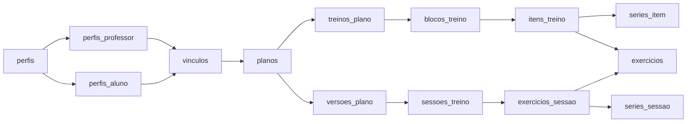

# V22 Fit Connect — Modelo de dados

Banco Postgres no Supabase, espelhado em parte no SQLite do aparelho. Regras de negócio em [`planejamento-app.md`](planejamento-app.md); telas em [`telas.md`](telas.md).

## Convenções

- **Nomes em português** (decidido em 2026-10-01): tabelas, colunas, funções e também os **valores de código** guardados nas colunas (ex.: `ativo`, `aluno`). `snake_case`, sem acento, sem abreviar demais. Datas e horas terminam em `_em` (`criado_em`), datas puras em `data_` (`data_nascimento`), chaves estrangeiras em `_id`, unidades no fim (`peso_kg`, `duracao_s`, `altura_cm`). Exceção: o schema `auth` e a tabela `auth.users` do Supabase.
- **Plano x série**: no banco, o que o app chama de "série de treino" (o plano inteiro) é `planos`; "série" no banco é sempre a série de repetições (`series_item`, `series_sessao`). Os textos mostrados ao usuário vêm do i18n e não dependem dos nomes do banco.
- **Ids**: `uuid` v7 gerado no próprio aparelho, para criar registros offline sem conflito.
- **Colunas de controle** em toda tabela sincronizada: `criado_em`, `atualizado_em`, `excluido_em` (exclusão lógica, para a exclusão chegar aos outros aparelhos) e `seq_sinc` (número crescente do servidor, usado para baixar só o que mudou). O servidor preenche `atualizado_em` e `seq_sinc` a cada gravação.
- **Carga sempre em kg** no banco; conversão para lb só na exibição.
- **Textos fixos do app** (músculos, equipamentos, objetivos) são códigos; a tradução fica nos arquivos de idioma do app, não no banco.
- **Segurança**: RLS (Row Level Security) em todas as tabelas; o aparelho só lê e grava o que a regra permite. Operações sensíveis (aceitar convite, desvincular, excluir conta) rodam em funções no servidor.
- **Dados de saúde** (anamnese, avaliações, fotos) só são lidos pelo próprio aluno e por professores com `compartilha_saude = true` no vínculo ativo.

## Visão geral

```mermaid
flowchart LR
    P[perfis] --> PA[perfis_aluno]
    P --> PP[perfis_professor]
    PP --> L[vinculos]
    PA --> L
    L --> PL[planos]
    PL --> W[treinos_plano] --> B[blocos_treino] --> I[itens_treino] --> S[series_item]
    I --> E[exercicios]
    PL --> V[versoes_plano]
    V --> WS[sessoes_treino] --> SE[exercicios_sessao] --> SS[series_sessao]
    SE --> E
```

Séries são editadas nas tabelas `planos → series_item`; a cada publicação gera-se um retrato imutável em `versoes_plano`. O treino executado aponta para a versão usada, então mudanças do professor nunca alteram o histórico.

## Contas e perfis

| Tabela | Campos principais | Observações |
| --- | --- | --- |
| `perfis` | `id` (= auth.users), `nome`, `caminho_avatar`, `data_nascimento`, `sexo`, `pais`, `idioma`, `unidade_peso`, `tema`, `status` (ativo, suspenso, exclusao_pendente), `exclusao_solicitada_em`, `nome_usuario` | `nome_usuario` fica vazio na v1; reservado para a rede social |
| `papeis_usuario` | `usuario_id`, `papel` (aluno, professor, admin, revisor) | Um usuário pode ter vários papéis |
| `perfis_aluno` | `usuario_id`, `altura_cm`, `objetivo`, `meta_semanal` | Peso fica em `registros_peso` |
| `registros_peso` | `aluno_id`, `peso_kg`, `data_registro`, `avaliacao_id` | O peso do cadastro é o primeiro registro; avaliação com peso também gera um |
| `anamneses` | `aluno_id`, `lesoes`, `condicoes`, `medicamentos`, `liberacao_medica`, `data_liberacao` | 1 por aluno; dado sensível |
| `perfis_professor` | `usuario_id`, `cref`, `cref_verificado_em`, `bio`, `especialidades[]`, `modalidade`, `preco_min`, `preco_max`, `moeda`, `instagram`, `whatsapp`, `nome_academia`, `cidade`, `estado`, `bairro`, `localizacao` (ponto PostGIS), `participa_diretorio`, `campos_publicos[]`, `oculto_pelo_admin`, `limite_alunos` | `localizacao` nunca sai do servidor; a busca devolve só a distância arredondada |
| `itens_curriculo` | `professor_id`, `tipo` (formacao, pos_graduacao, certificacao, experiencia), `titulo`, `instituicao`, `ano_inicio`, `ano_fim`, `posicao` | Currículo estruturado |

## Vínculos, convites e moderação

| Tabela | Campos principais | Observações |
| --- | --- | --- |
| `vinculos` | `professor_id`, `aluno_id`, `status` (ativo, encerrado), `iniciado_em`, `encerrado_em`, `encerrado_por`, `compartilha_saude` | Base de quase todas as regras de acesso |
| `convites` | `codigo`, `criado_por`, `papel_criador`, `expira_em`, `usado_por`, `usado_em` | Uso único, 7 dias |
| `pedidos_vinculo` | `aluno_id`, `professor_id`, `mensagem`, `status` (pendente, aceito, recusado, expirado), `expira_em` | Máx. 3 pendentes por aluno (checado no servidor) |
| `bloqueios` | `bloqueador_id`, `bloqueado_id` | Impede convites e pedidos |
| `denuncias` | `denunciante_id`, `usuario_alvo_id`, `motivo`, `detalhes`, `status`, `resolvido_por`, `resolucao` | Fila de denúncias |
| `sancoes` | `usuario_id`, `tipo` (suspensao, banimento), `motivo`, `criado_por`, `ate` | Histórico de punições |

## Exercícios

| Tabela | Campos principais | Observações |
| --- | --- | --- |
| `exercicios` | `origem` (oficial, usuario), `dono_id`, `status` (rascunho, publicado), `status_revisao` (pendente, promovido, mesclado, descartado), `mesclado_em_id`, `musculo_principal`, `musculos_secundarios[]`, `parte_corpo`, `equipamento`, `nivel`, `tipo_carga_padrao`, `caminho_imagem_inicio`, `caminho_imagem_fim`, `ref_origem` | `ref_origem` = id no Free Exercise DB |
| `traducoes_exercicio` | `exercicio_id`, `idioma`, `nome`, `descricao`, `execucao`, `revisado_em`, `revisado_por` | Descrição/execução só aparecem se revisadas |
| `apelidos_exercicio` | `exercicio_id`, `idioma`, `apelido`, `origem` (ia, usuario), `aprovado` | Alimenta o autocomplete |
| `compartilhamentos_exercicio` | `exercicio_id`, `professor_id`, `pode_editar` | Aluno libera seu exercício para um professor |
| `uso_exercicio` | `usuario_id`, `exercicio_id`, `contagem`, `ultimo_uso_em` | Ordena o autocomplete; só no aparelho + backup |

Exercício de professor fica visível ao aluno que tem série com ele (regra RLS via `itens_treino`).

## Séries

| Tabela | Campos principais | Observações |
| --- | --- | --- |
| `planos` | `autor_id`, `aluno_id` (vazio = modelo), `professor_id`, `e_modelo`, `nome`, `organizacao` (sequencia, dia_semana), `data_inicio`, `data_fim`, `meta_semanal`, `copiado_de_id`, `versao_atual`, `status` (ativo, arquivado), `orfao` | `orfao` = professor excluiu a conta; a série passa ao aluno |
| `treinos_plano` | `plano_id`, `nome`, `posicao`, `dia_semana` | Nome livre na sequência; `dia_semana` na organização por dia |
| `blocos_treino` | `treino_id`, `posicao`, `tipo` (simples, biset, triset) | |
| `itens_treino` | `bloco_id`, `exercicio_id`, `posicao`, `descanso_s`, `cadencia`, `tipo_carga`, `observacoes` | |
| `series_item` | `item_id`, `posicao`, `e_aquecimento`, `tipo_serie` (normal, dropset, rest_pause), `alvo` (repeticoes, faixa, falha, tempo, cardio), `repeticoes_min`, `repeticoes_max`, `duracao_s`, `distancia_m`, `intensidade`, `carga_kg`, `mini_series` (json) | `mini_series` = quedas do drop-set / pausas do rest-pause |
| `versoes_plano` | `plano_id`, `versao`, `instantaneo` (json da série inteira), `publicada_em` | Imutável |

## Execução

| Tabela | Campos principais | Observações |
| --- | --- | --- |
| `sessoes_treino` | `aluno_id`, `plano_id`, `versao_plano`, `treino_id`, `iniciada_em`, `finalizada_em`, `finalizada_automaticamente`, `manual`, `observacoes`, `volume_kg` | `volume_kg` calculado ao finalizar (sem aquecimento) |
| `exercicios_sessao` | `sessao_id`, `posicao`, `exercicio_id`, `item_planejado_id`, `substituido_de_id`, `tipo_carga` | Substituição guarda o exercício original |
| `series_sessao` | `exercicio_sessao_id`, `posicao`, `serie_pai_id`, `e_aquecimento`, `tipo_serie`, `status` (feita, pulada), `carga_kg`, `repeticoes`, `duracao_s`, `distancia_m`, `tempo_exercicio_s`, `descanso_s`, `observacoes` | `serie_pai_id` liga a mini-série à série |
| `recordes_pessoais` | `aluno_id`, `exercicio_id`, `tipo_carga`, `repeticoes`, `carga_kg`, `serie_sessao_id`, `alcancado_em` | Cache recalculável a partir de `series_sessao` |

## Avaliações

| Tabela | Campos principais | Observações |
| --- | --- | --- |
| `avaliacoes` | `aluno_id`, `autor_id`, `data_avaliacao`, `peso_kg`, `gordura_pct`, `medidas` (json: cintura, quadril, braço…), `observacoes` | Autor pode ser aluno ou professor |
| `fotos_avaliacao` | `avaliacao_id`, `caminho_storage`, `pose` (frente, lado, costas) | Bucket privado; acesso por URL assinada |

## Motivação e notificações

| Tabela | Campos principais | Observações |
| --- | --- | --- |
| `conquistas` | `codigo`, `regra` (json), `pose_mascote`, `posicao` | Catálogo, editável no admin |
| `conquistas_usuario` | `usuario_id`, `codigo`, `conquistada_em` | Sequência semanal é calculada, não gravada |
| `tokens_push` | `usuario_id`, `token`, `plataforma`, `nome_aparelho`, `visto_em` | |
| `notificacoes` | `usuario_id`, `tipo`, `dados` (json), `lida_em` | Alimenta o sininho |
| `preferencias_notificacao` | `usuario_id`, `tipo`, `ativa` | |
| `lembretes_treino` | `usuario_id`, `dias_semana[]`, `horario`, `fuso_horario` | Agendado no próprio aparelho |

## Suporte, conteúdo e admin

| Tabela | Campos principais | Observações |
| --- | --- | --- |
| `chamados_suporte` | `usuario_id`, `tipo` (contato, bug), `assunto`, `mensagem`, `caminho_captura`, `versao_app`, `aparelho`, `status` | |
| `faq` | `idioma`, `pergunta`, `resposta`, `posicao`, `status` (rascunho, publicado) | Revisor edita, admin publica |
| `comunicados` | `publico` (json), `textos` (json por idioma), `agendado_para`, `enviado_em`, `criado_por` | Push em massa |
| `config_app` | `chave`, `valor` | Versão mínima, limite padrão de alunos, palavras bloqueadas |
| `log_auditoria_admin` | `ator_id`, `acao`, `tabela_alvo`, `alvo_id`, `detalhes`, `criado_em` | Somente inserção |
| `exportacoes_dados` | `usuario_id`, `status`, `caminho_storage`, `expira_em` | Arquivo de "exportar meus dados" |

## Sincronização offline

- **No aparelho (SQLite)**: perfil próprio, vínculos, séries atribuídas e próprias (com as versões), treinos, recordes, avaliações (sem as fotos), conquistas, notificações e o catálogo de exercícios no idioma do usuário.
- **Imagens dos exercícios**: as dos exercícios das séries do aluno baixam automaticamente; as demais, na primeira vez que são abertas, e ficam em cache.
- **Só online**: diretório, perfis públicos, fotos de evolução, admin, suporte.
- **Baixar**: o aparelho pede tudo com `seq_sinc` maior que o último recebido.
- **Enviar**: fila local de alterações, enviada em lote quando há conexão; o servidor valida pelas regras de RLS.
- **Conflitos**: o último a chegar ao servidor vence, por registro (decidido em 2026-10-01; vale a ordem de chegada, não o relógio do aparelho). Treinos em si nunca conflitam (só o aluno grava). Série do professor editada durante um treino offline segue a regra de versão.
- **Registros apagados**: a exclusão lógica (`excluido_em`) não é limpa na v1; qualquer aparelho, mesmo parado há meses, recebe as exclusões (decidido em 2026-10-01).
- **Versão mínima**: o app compara sua versão com `config_app` antes de sincronizar.

## Estimativa de espaço (cota de 500 MB)

Um treino típico ocupa ~5 KB no Postgres (sessão + ~25 séries registradas, com índices). Com 1.000 alunos ativos treinando 4×/semana, são ~200 mil treinos e ~1 GB por ano: a cota de 500 MB acaba em cerca de 6 meses nesse ritmo.

Saídas, em ordem:
1. Guardar treinos com mais de 6 meses compactados (um JSON por treino em vez de uma linha por série), o que reduz ~5×.
2. Plano Pro do Supabase (US$ 25/mês, 8 GB).

O alerta de 80% no painel admin avisa com antecedência.
