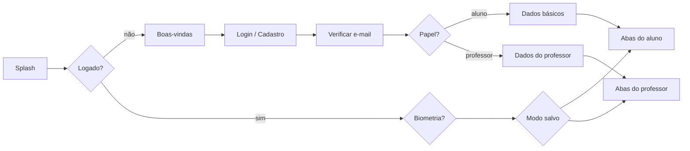

# V22 Fit Connect — Mapa de telas

Todas as telas da v1 (app, site web e admin), por papel. Regras de negócio em [`planejamento-app.md`](planejamento-app.md).

Códigos: `E` entrada · `AL` aluno · `TR` treino em execução · `PR` professor · `C` compartilhadas · `W` web do professor · `AD` admin · `LP` landing page.

## Navegação

- Aluno: 5 abas — Início, Séries, Progresso, Professores, Perfil.
- Professor: 4 abas — Painel, Alunos, Modelos, Perfil.
- Professor alterna para o modo aluno pela chave "Usar como aluno" no Perfil: a barra troca para as abas do aluno, com faixa no topo indicando o modo. O app lembra o último modo.
- Papel escolhido após o primeiro login ("Sou aluno" / "Sou professor"); aluno pode ativar o perfil de professor depois, pelo Perfil.
- Tablet: listas e detalhes lado a lado (ex.: Alunos à esquerda, ficha à direita).

Link de convite aberto sem conta leva ao cadastro e, ao terminar, direto à confirmação do vínculo.

## Entrada (E)

| Código | Tela | Conteúdo |
| --- | --- | --- |
| E-01 | Splash | Logo sobre `#040C19`; decide o destino |
| E-02 | Boas-vindas | Mascote, 2–3 cartões do que o app faz, "Entrar" / "Criar conta" |
| E-03 | Login | E-mail/senha, Google, Apple, "esqueci a senha" |
| E-04 | Cadastro | Nome, e-mail, senha, aceite de termos e privacidade |
| E-05 | Verificar e-mail | Aviso, reenviar, trocar e-mail |
| E-06 | Recuperar senha | Pedido e redefinição |
| E-07 | Escolher papel | "Sou aluno" / "Sou professor" |
| E-08 | Dados básicos do aluno | Nascimento (bloqueia < 16), sexo, peso, altura, objetivo; anamnese "preencher depois" |
| E-09 | Dados do professor | Nome, foto, país, CREF (obrigatório no Brasil) |
| E-10 | Permissões | Notificações (explicando o porquê); localização só quando usar "perto de mim" |
| E-11 | Desbloqueio | Biometria, quando ativada |
| E-12 | Conta em exclusão | Durante os 30 dias: "Reativar conta" ou sair |
| E-13 | Conta suspensa | Motivo e contato do suporte |

## Aluno (AL)

### Início

| Código | Tela | Conteúdo |
| --- | --- | --- |
| AL-01 | Início | Treino de hoje (próximo da sequência, ou o do dia na série por dia da semana) + "Iniciar" (ou "Continuar") e "Trocar treino"; sequência e meta da semana; avisos; sininho de notificações |
| AL-02 | Sem série | Estado vazio com mascote: "Criar minha série" ou "Encontrar professor" |

### Séries

| Código | Tela | Conteúdo |
| --- | --- | --- |
| AL-10 | Minhas séries | Agrupadas por professor + "Minhas séries"; selo de vencida; "Criar série" |
| AL-11 | Detalhe da série | Treinos da divisão (nomes livres) ou por dia, data de fim, autor, meta semanal; iniciar qualquer treino |
| AL-12 | Detalhe do treino | Exercícios com blocos, prescrição, descanso, cadência; "Iniciar" |
| AL-13 | Editor de série | Criar/editar série própria (usa os mesmos componentes do editor do professor, C-10 a C-13) |

### Progresso

| Código | Tela | Conteúdo |
| --- | --- | --- |
| AL-20 | Progresso | Atalhos: histórico, gráficos, recordes, avaliações, conquistas, resumos |
| AL-21 | Histórico | Calendário + lista; "Lançar treino manual" |
| AL-22 | Treino realizado | Séries feitas, cargas, tempos, observações, versão da série usada; editar (marca "manual") |
| AL-23 | Lançar treino manual | Escolhe série/treino e data; registra sem cronômetro |
| AL-24 | Evolução do exercício | Gráfico de carga (sem aquecimento, sem misturar tipo de carga), lista de execuções |
| AL-25 | Recordes | Maior carga e maior carga por nº de reps, por exercício |
| AL-26 | Avaliações | Histórico de avaliações físicas (autor de cada uma); "Nova avaliação" |
| AL-27 | Nova/editar avaliação | Medidas, % de gordura, fotos de evolução |
| AL-28 | Comparar fotos | Duas datas lado a lado |
| AL-29 | Conquistas | Medalhas com poses do mascote, conquistadas e bloqueadas |
| AL-30 | Resumo semanal/mensal | Treinos, volume, recordes; compartilhar como imagem |
| AL-31 | Peso | Gráfico do peso e "Registrar peso" rápido, sem abrir avaliação |

### Professores

| Código | Tela | Conteúdo |
| --- | --- | --- |
| AL-40 | Professores | Meus professores, pedidos pendentes, atalhos para diretório e convites |
| AL-41 | Vínculo com professor | Séries dele, permissão dos dados de saúde (anamnese/avaliação), desfazer vínculo |
| AL-42 | Diretório | Busca por cidade/estado, filtros (especialidade, modalidade), "perto de mim" |
| AL-43 | Perfil público do professor | Bio, especialidades, currículo, local (bairro + distância), modalidade, preço, contatos, selo CREF verificado; "Pedir vínculo", denunciar, bloquear |
| AL-44 | Pedir vínculo | Mensagem curta; aviso do limite de 3 pendentes |
| AL-45 | Convites | Gerar código/link, digitar código recebido |
| AL-46 | Confirmar vínculo | Mostra quem convidou; escolhe compartilhar dados de saúde; aceitar/recusar |

### Perfil

| Código | Tela | Conteúdo |
| --- | --- | --- |
| AL-50 | Perfil | Foto, nome, atalhos; para professor, a chave "Usar como aluno" |
| AL-51 | Dados pessoais | Nascimento, sexo, peso, altura, objetivo |
| AL-52 | Anamnese | Lesões, doenças, medicamentos, liberação médica |
| AL-53 | Meus exercícios | Exercícios criados pelo aluno; liberar para professor ver/editar |
| AL-54 | Tornar-me professor | Dados do professor (igual a E-09) |

Configurações e ajuda são compartilhadas (C-30 a C-39).

## Treino em execução (TR)

Tela cheia, fora das abas, botões grandes. Continua em segundo plano com notificação fixa.

| Código | Tela | Conteúdo |
| --- | --- | --- |
| TR-01 | Exercício atual | Nome, animação, prescrição, séries do bloco, carga/reps da última vez; registrar carga, reps, feito/pulado |
| TR-02 | Descanso | Cronômetro regressivo grande, +15 s / −15 s, pular descanso, próximo exercício com a carga da última vez |
| TR-03 | Exercício por tempo | Cronômetro regressivo da isometria |
| TR-04 | Cardio | Tempo, distância, intensidade |
| TR-05 | Substituir exercício | Busca na base (autocomplete offline) |
| TR-06 | Visão geral do treino | Todos os exercícios, pular para qualquer um, observação livre |
| TR-07 | Finalizar | Resumo: duração, volume, exercícios, recordes |
| TR-08 | Recorde pessoal | Celebração com a harpia |
| TR-09 | Foto do treino | "Quer tirar uma foto?" → câmera → arte com logo + resumo → salvar na galeria / Instagram |
| TR-10 | Conquista desbloqueada | Medalha com pose do mascote |
| TR-11 | Série atualizada | Aviso de que o professor mudou a série (vale no próximo treino) |

## Professor (PR)

### Painel

| Código | Tela | Conteúdo |
| --- | --- | --- |
| PR-01 | Painel | Treinos concluídos hoje, alunos parados há X dias, séries vencendo, pedidos de vínculo, anamneses vazias |
| PR-02 | Pedidos de vínculo | Mensagem do aluno; aceitar/recusar |

### Alunos

| Código | Tela | Conteúdo |
| --- | --- | --- |
| PR-10 | Alunos | Lista com busca e filtros (ativo, parado, série vencendo); convidar aluno |
| PR-11 | Ficha do aluno | Dados básicos, objetivo, séries, últimos treinos, frequência |
| PR-12 | Anamnese do aluno | Somente leitura, se autorizada |
| PR-13 | Avaliações do aluno | Histórico e "Nova avaliação" (se autorizado) |
| PR-14 | Treino realizado | Resumo de um treino do aluno (marcação "manual" quando for o caso) |
| PR-15 | Evolução do aluno | Gráficos e recordes do aluno, nos exercícios das séries do professor |
| PR-16 | Nova série para aluno | Do zero, de um modelo ou copiando a série de outro aluno |
| PR-17 | Ex-alunos | Somente leitura do que existia antes do desvínculo |

### Modelos

| Código | Tela | Conteúdo |
| --- | --- | --- |
| PR-20 | Modelos | Biblioteca de séries-modelo; criar, duplicar, excluir |
| PR-21 | Editor de modelo | Mesmo editor de série (C-10 a C-13) |
| PR-22 | Aplicar modelo | Escolher alunos, data de fim e meta semanal |

### Perfil

| Código | Tela | Conteúdo |
| --- | --- | --- |
| PR-30 | Perfil | Foto, nome, CREF, atalhos, chave "Usar como aluno" |
| PR-31 | Perfil público | Aparecer no diretório (opt-in), bio, especialidades, modalidade, preço, contatos; o que fica visível |
| PR-32 | Local de atendimento | Cidade, bairro, academia, ponto no mapa (usado só para a distância) |
| PR-33 | Currículo | Formação, pós, certificações, experiências |
| PR-34 | Meus exercícios | Exercícios criados pelo professor |
| PR-35 | Prévia do perfil público | Como o aluno vê no diretório |

## Compartilhadas (C)

| Código | Tela | Conteúdo |
| --- | --- | --- |
| C-01 | Guia do exercício | Nome, variações, músculos, descrição, execução, animação inicial/final |
| C-02 | Buscar exercício | Autocomplete offline, filtros por músculo e equipamento |
| C-03 | Criar exercício | Nome, músculos, equipamento, tipo de carga, descrição |
| C-10 | Editor de série | Nome, organização (sequência com treinos de nome livre, ou por dia da semana), data de fim, meta semanal, lista de treinos |
| C-11 | Editor de treino | Exercícios e blocos (bi-set, tri-set), reordenar |
| C-12 | Prescrição do exercício | Tipo (reps, faixa, falha, tempo, cardio), séries, aquecimento, drop-set/rest-pause, carga, cadência, descanso, tipo de carga |
| C-13 | Prévia da série | Como o aluno vai ver |
| C-20 | Notificações | Lista das notificações recebidas (sininho), inclusive para quem desativou o push |
| C-30 | Configurações | Idioma, tema, kg/lb, biometria |
| C-31 | Notificações (config.) | Liga/desliga cada tipo; lembrete de treino (dias e horário) |
| C-32 | Usuários bloqueados | Lista e desbloquear |
| C-33 | Conta | Trocar e-mail/senha, contas vinculadas (Google/Apple), sair |
| C-34 | Exportar meus dados | Gerar arquivo + CSV dos treinos |
| C-35 | Excluir conta | Explica os 30 dias e o que acontece com séries e históricos |
| C-36 | Ajuda (FAQ) | Perguntas frequentes |
| C-37 | Fale conosco | Assunto, mensagem, print opcional |
| C-38 | Denunciar | Motivo e detalhes |
| C-39 | Sobre | Versão, termos, privacidade, licenças |
| C-40 | Sem conexão | Faixa/aviso com mascote; o que funciona offline |
| C-41 | Atualização obrigatória | Quando a versão instalada não é mais suportada |

## Web do professor (W)

Mesmo site do admin, área do professor. Espelha o app, com mais espaço.

| Código | Tela | Conteúdo |
| --- | --- | --- |
| W-01 | Login | E-mail/senha, Google, Apple |
| W-02 | Painel | Igual a PR-01 |
| W-10 | Alunos | Tabela com filtros e ordenação |
| W-11 | Ficha do aluno | PR-11 a PR-15 em abas |
| W-20 | Editor de série | Editor em tela larga, arrastar e soltar, atalhos de teclado |
| W-21 | Modelos | PR-20 a PR-22 |
| W-30 | Perfil público e currículo | PR-31 a PR-35 |
| W-31 | Meus exercícios | PR-34 |
| W-40 | Configurações da conta | C-30 a C-35 |

## Admin (AD)

2FA obrigatório no login. Toda ação fica no log.

| Código | Tela | Conteúdo |
| --- | --- | --- |
| AD-01 | Login + 2FA | Senha e código do autenticador; códigos de recuperação |
| AD-02 | Painel | Usuários, uso, cotas grátis (alerta 80%), filas pendentes |
| AD-10 | Exercícios oficiais | Lista, busca, editar, publicar |
| AD-11 | Editar exercício | Campos, traduções PT/EN/ES, variações de nome, imagens |
| AD-12 | Fila de exercícios de usuários | Agrupados por similaridade, contagem; promover a oficial, mesclar, descartar |
| AD-13 | Fila de textos de IA | Descrições e execuções geradas aguardando revisão |
| AD-14 | Fila de traduções | Revisão PT/ES |
| AD-20 | Usuários | Busca; suspender/banir, selo CREF verificado |
| AD-21 | Diretório | Perfis públicos; ocultar |
| AD-22 | Denúncias | Fila com contexto e ação tomada |
| AD-23 | Suporte | Mensagens do "fale conosco" e reportes de problema |
| AD-30 | Push em massa | Público (todos, alunos, professores, idioma), texto em 3 idiomas, agendar |
| AD-31 | FAQ e textos | Editar rascunho; admin publica |
| AD-32 | Conquistas | Lista das conquistas e regras |
| AD-40 | Configurações | Limite de alunos por professor, palavras bloqueadas, versão mínima do app |
| AD-41 | Equipe | Admins e revisores, papéis |
| AD-42 | Log de ações | Quem, o quê, quando |

## Landing page (LP)

| Código | Tela | Conteúdo |
| --- | --- | --- |
| LP-01 | Início | Marca, mascote, benefícios para aluno e professor, links das lojas |
| LP-02 | Termos de uso | 3 idiomas |
| LP-03 | Política de privacidade | 3 idiomas |
| LP-04 | Suporte | FAQ e contato |
| LP-05 | Excluir conta | Instruções (exigido pelo Google Play) |
| LP-06 | Convite | Página do link de convite: abre o app ou leva à loja |

## Pontos a confirmar

- Admin sem tela de dados da conta: AD-20 hoje mostra apenas o necessário para suspender/banir e dar o selo. Confirmar se isso basta para o suporte.
